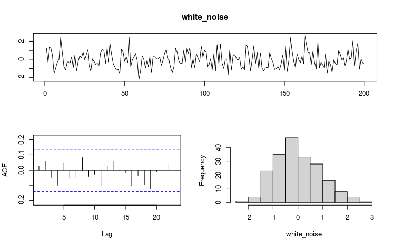
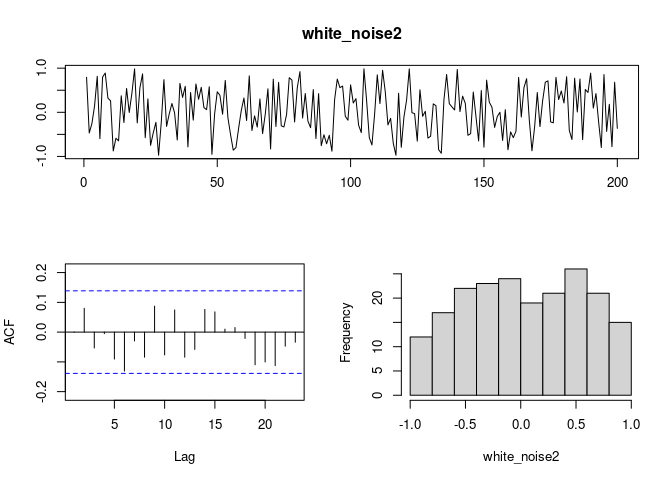
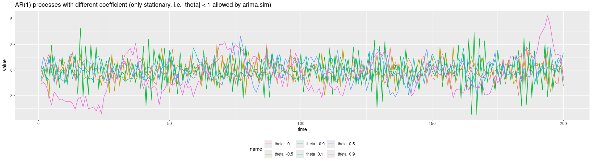
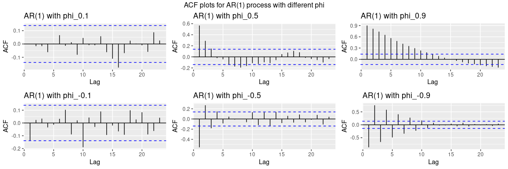
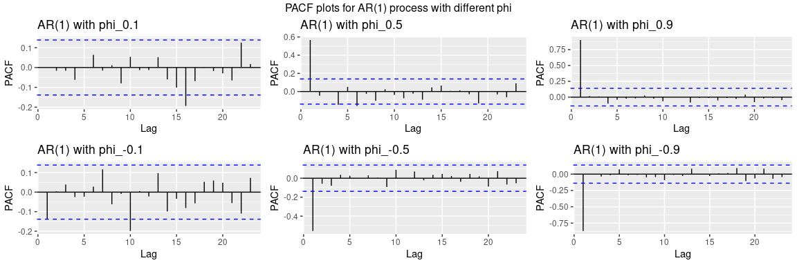

``` r
library(forecast)
library(ggplot2)
library(tidyr)
library(gridExtra)
```

# Types of noise

## 1.1.1. White noise

Variable
 is a white noise if it meets only three conditions: -  = 0"), -  = \\sigma^2"), -  = 0").

Note it doesn’t have to be normally distributed (then we call it
“gaussian noise”) - but in many cases it is.

``` r
set.seed(0)
white_noise = rnorm(200)
tsdisplay(white_noise, plot.type = "histogram", points = FALSE)
```

<!-- -->

``` r
mean(white_noise)
```

    ## [1] -0.01144155

``` r
var(white_noise)
```

    ## [1] 0.8524895

``` r
set.seed(0) # for seed = 7 there is an accidental autocorrelation
white_noise2 = runif(200, min = -1, max = 1)
tsdisplay(white_noise2, plot.type = "histogram", points = FALSE)
```

<!-- -->

``` r
mean(white_noise2)
```

    ## [1] 0.03645731

``` r
var(white_noise2) # 1/3 is a theoretical value
```

    ## [1] 0.2909825

## Autoreggresive Processes AR(p)

The Autoregressive process is given by the equation

  
  

### AR(1)

AR(1) process   
  

is stationary if . In R we can simulate such process using `arima.sim`
function. Greater absolute value results in greater “amplitude” and
negative phi causes oscilations from positive to negative.

See page 87 of
<https://sistemas.fciencias.unam.mx/~ediaz/Cursos/Estadistica3/Libros/Time%20Series%20Analysis%20and%20Its%20Applications.pdf>.

##### Proof of stationarity

  
  
  
 + w_t")  

  
 + w_{t-1}) + w_t")  

  
  

  
  

``` r
N <- 200
ar1_processes <- matrix(nrow = 7, ncol = N)
ar1_processes[1,] <- 1:N
ar1_processes[2,] <- arima.sim(model = list(ar = c(0.1)), n = N)
ar1_processes[3,] <- arima.sim(model = list(ar = c(0.5)), n = N)
ar1_processes[4,] <- arima.sim(model = list(ar = c(0.9)), n = N)
ar1_processes[5,] <- arima.sim(model = list(ar = c(-0.1)), n = N)
ar1_processes[6,] <- arima.sim(model = list(ar = c(-0.5)), n = N)
ar1_processes[7,] <- arima.sim(model = list(ar = c(-0.9)), n = N)

# Note: you can use arima.sim only to simulate a stationary process. To simulate non-stationary one,
# use Arima.

ar1_processes <- as.data.frame(t(ar1_processes)) 
colnames(ar1_processes) <- c(
  "time", "phi_0.1", "phi_0.5", "phi_0.9", "phi_-0.1", "phi_-0.5", "phi_-0.9")

ar1_processes %>% pivot_longer(cols = 2:7) %>% 
  ggplot(aes(x = time, y = value, col = name)) +
  geom_line() + 
  ggtitle("AR(1) processes with different coefficient (only stationary, i.e. |phi| < 1 allowed by arima.sim)") +
  theme(legend.position = "bottom")
```

<!-- -->

``` r
ar1_acfs <- list()
for (name in colnames(ar1_processes)[-1]){
  ar1_acfs[[name]] <- ar1_processes[name] %>% ggAcf() +
    ggtitle(paste("AR(1) with", name))
}

gridExtra::grid.arrange(
  grobs = ar1_acfs, nrow = 2, top = "ACF plots for AR(1) process with different phi")
```

<!-- -->

``` r
ar1_pacfs <- list()
for (name in colnames(ar1_processes)[-1]){
  ar1_pacfs[[name]] <- ar1_processes[name] %>% ggPacf() +
    ggtitle(paste("AR(1) with", name))
}

gridExtra::grid.arrange(
  grobs = ar1_pacfs, nrow = 2, top = "PACF plots for AR(1) process with different phi")
```

<!-- -->

#### Stationary AR(1)

#### Random walk

AR(1) process with an unit root  is called a random walk. It’s expected value is  = t\\mu"), where ") and it’s variance is  = \\sum^t_{i=1} Var(w_t) = t\\sigma^2"), therefore it is not
stationary.

``` r
# generate_AR <- function(AR_coefs, sigma, n){
#   p <- length(AR_coefs)
#   Y <- rnorm(p, sd = sigma)
#   for (i in 1:(n-p)){
#     Y_i <- AR_coefs %*% Y + epsilon_i
#     Y <- c(Y, Y_i)
#   }
#   return(Y)
# }
# 
# # AR(1)
# X <- generate_AR(
#   AR_coefs = c(0.5),
#   sigma = 1,
#   n = 200
# )
```
